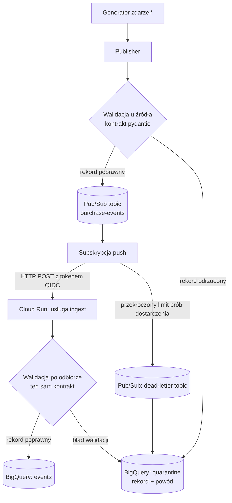
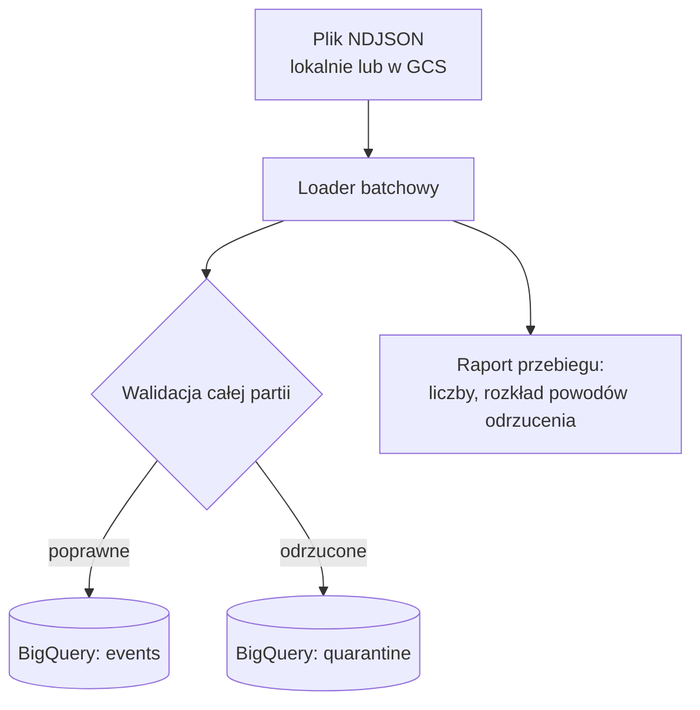
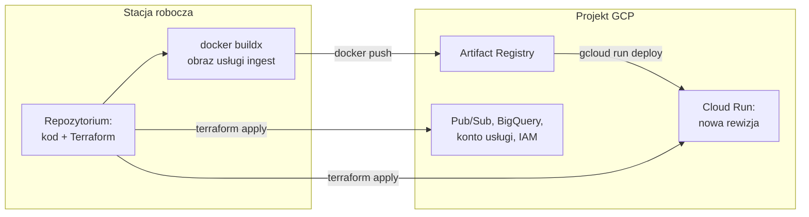

# Shift-left data quality z pydantic

Walidacja zdarzeń ecommerce **zanim** trafią do hurtowni. Jeden wersjonowany kontrakt
pydantic pilnuje dwóch pipeline'ów naraz — streamingowego i batchowego — na Google Cloud.

> **Status: projekt w budowie.** Etap 1 z 7 gotowy (szkielet i narzędzia).
> Plan wszystkich etapów znajdziesz niżej, w sekcji [Etapy prac](#etapy-prac).

## Dlaczego shift-left

Zły rekord wykryty w hurtowni kosztuje wielokrotnie więcej niż ten sam rekord odrzucony
u źródła: zdążył już zasilić raporty, modele atrybucji i decyzje zakupowe. Shift-left
przesuwa walidację do momentu powstania zdarzenia — do kwarantanny trafia pojedynczy
rekord z powodem odrzucenia, a nie cała partia po fakcie.

## Szybki start

```bash
make setup   # instaluje Pythona 3.12, tworzy .venv, synchronizuje workspace uv
make check   # ruff + mypy strict + pytest — dokładnie ta sama bramka, którą odpala CI
```

Pełna lista komend: `make help`.

## Etapy prac

Projekt powstaje etapami. Każdy etap kończy się działającą komendą, a nie samym kodem —
jeśli czegoś nie da się uruchomić jedną komendą, etap nie jest zamknięty.

### Etap 1 — szkielet i narzędzia ✅

**Co robimy:** workspace uv z dwoma wersjonowanymi pakietami, ruff, mypy w trybie strict,
pytest z pomiarem pokrycia, Makefile jako jedyny interfejs do projektu, GitHub Actions
uruchamiające tę samą bramkę co lokalne `make check`.

**Co to dodaje:** fundament, który wymusza jedno źródło prawdy. Zależność
`dq-contracts = { workspace = true }` sprawia, że kontrakt rozwiązuje się do kodu z dysku,
więc fizycznie nie da się mieć dwóch jego wersji w dwóch pipeline'ach. Od tego momentu każdy
kolejny etap wchodzi do repozytorium przez tę samą bramkę jakości.

**Sprawdzisz:** `make check`

### Etap 2 — kontrakt danych

**Co robimy:** modele pydantic opisujące zdarzenie zakupu — typy ograniczone przez
`Annotated` i `Field`, `ConfigDict(strict=True, extra="forbid")`, walidatory pojedynczych pól
(`field_validator`) i walidatory spójności między polami (`model_validator`), mapowanie
`ValidationError` na rekord kwarantanny z powodem odrzucenia. Każda reguła dostaje test
pozytywny i negatywny.

**Co to dodaje:** samą istotę projektu — wykonywalną definicję tego, czym jest poprawne
zdarzenie. Do tej pory „poprawne dane" było pojęciem z dokumentacji; od tego etapu jest
kodem, który można uruchomić i który przy złym rekordzie mówi, co konkretnie jest nie tak.

**Sprawdzisz:** `make test`

### Etap 3 — generator danych syntetycznych

**Co robimy:** parametryzowany generator zdarzeń: liczba rekordów, odsetek błędnych, rodzaje
wstrzykiwanych błędów, ziarno losowości dla powtarzalności. Katalog błędów odpowiada
jeden do jednego liście reguł z etapu 2.

**Co to dodaje:** możliwość pokazania kwarantanny w działaniu. Walidator, którego nikt nie
nakarmił złymi danymi, jest wart tyle co nieuruchomiony test. Ziarno losowości sprawia, że
ten sam parametr daje ten sam zestaw danych — bez tego benchmark z etapu 5 mierzyłby szum.

**Sprawdzisz:** `make gen N=1000 ERR=0.2`

### Etap 4 — streaming lokalnie

**Co robimy:** emulator Pub/Sub w Dockerze, publisher walidujący zdarzenia przed wysłaniem,
subskrypcja push do lokalnej usługi ingest (odpowiednik Cloud Run), walidacja po odbiorze,
temat dead-letter dla wiadomości, których nie da się przetworzyć.

**Co to dodaje:** dowód, że cały pipeline działa bez konta GCP i bez wydawania złotówki —
tym samym kodem ścieżki biznesowej, który potem pójdzie do chmury. Pokazuje też, po co
walidować dwa razy: producent nie zaśmieca tematu, konsument nie ufa producentowi.

**Sprawdzisz:** `make local-stream`

### Etap 5 — batch lokalnie

**Co robimy:** przetwarzanie całego pliku naraz, raport z przebiegu (ile rekordów przeszło,
ile wylądowało w kwarantannie, rozkład powodów odrzucenia), idempotentność (ponowne wgranie
tego samego pliku nie duplikuje wierszy) oraz benchmark na 100 tys. rekordów.

**Co to dodaje:** to, czego nie widać w streamingu — koszt walidacji w liczbach i zestawienie
`model_validate` z `model_construct` oraz `TypeAdapter`. Odpowiada na pytanie, kiedy pominięcie
walidacji jest uzasadnione, a kiedy jest po prostu oszczędzaniem na hamulcach.

**Sprawdzisz:** `make batch-local` oraz `make bench`

### Etap 6 — infrastruktura jako kod

**Co robimy:** Terraform opisujący komplet zasobów: projekt GCP, włączenie potrzebnych API,
tematy i subskrypcje Pub/Sub, temat dead-letter, dataset i tabele BigQuery, usługa Cloud Run,
konto usługi z minimalnymi uprawnieniami. Schematy tabel generuje `make schemas` z modeli
pydantic, a CI pilnuje, żeby wygenerowany schemat nie rozjechał się z zacommitowanym.

**Co to dodaje:** domknięcie idei jednego źródła prawdy aż do hurtowni — definicja tabeli
przestaje być czymś, co ktoś kiedyś wyklikał w konsoli. Infrastruktura jest tu **kodem do
przeczytania i zwalidowania, nie uruchomioną chmurą**: `terraform apply` świadomie nie zostaje
wykonany, więc punkt „demo na GCP" pozostaje niezaznaczony. Kod ma komentarze wyjaśniające
krok po kroku, co zrobić, żeby go odpalić.

**Sprawdzisz:** `make tf-validate` (walidacja bez konta GCP, przez obraz Dockera)

### Etap 7 — dokumentacja

**Co robimy:** pełne README — opis problemu, diagram architektury w Mermaid, lista usług GCP
z uzasadnieniem każdej, instrukcja uruchomienia od zera, opis wszystkich reguł walidacji,
przykłady rekordów w kwarantannie z powodem odrzucenia, wyniki benchmarku, szacunek kosztów,
procedura teardown oraz sekcja decyzji architektonicznych i wariantów odrzuconych.

**Co to dodaje:** warunek, bez którego projekt nie ma sensu jako portfolio — obca osoba ma
odtworzyć całość bez zadawania pytań autorowi.

## Architektura przepływu danych

Ścieżka streamingowa — od wygenerowania zdarzenia do wiersza w hurtowni:



Walidacja wykonuje się dwa razy i to jest decyzja, nie przeoczenie: producent nie zaśmieca
tematu, a konsument nie ufa producentowi. Koszt tej duplikacji mierzymy w etapie 5.

Rozróżnienie kwarantanny od dead-letter: do kwarantanny trafia rekord, który **udało się
odczytać**, ale złamał regułę biznesową — znamy powód i da się go naprawić. Na dead-letter
trafia wiadomość, której nie dało się przetworzyć w ogóle (uszkodzony JSON, błąd usługi),
więc Pub/Sub poddał się po ustalonej liczbie prób.

Ścieżka batchowa — ten sam kontrakt, inny tryb pracy:



## Jak wyglądałoby wdrożenie

**Ważne zastrzeżenie:** w tym repozytorium infrastruktura jest **kodem, nie uruchomioną
chmurą**. Terraform jest kompletny i zwalidowany (`terraform validate`), ale `terraform apply`
świadomie nie zostaje wykonany — nie istnieje projekt GCP, nie ma rachunku, nie ma wdrożonej
usługi. Poniższy opis mówi więc, co by się stało po uruchomieniu, a nie co się wydarzyło.
Punkt „demo na GCP" w Definition of Done pozostaje niezaznaczony i tak jest to oznaczone.

### Gdzie żyje który element

| Element | Miejsce docelowe | Uwaga |
| --- | --- | --- |
| `dq-contracts` | wewnątrz obrazu usługi ingest oraz w środowisku publishera i loadera | To biblioteka, nie usługa — nie wdraża się jej osobno. Jej wersja jedzie w kopercie każdego zdarzenia. |
| Usługa ingest | Cloud Run (region `europe-central2`) | Skalowanie do zera: brak ruchu = brak kosztu. |
| Obraz kontenera | Artifact Registry | Budowany lokalnie (`docker buildx --platform linux/amd64`) i wypychany do rejestru. |
| Publisher | uruchamiany z laptopa przez ADC, docelowo Cloud Run Job | W demo to narzędzie, nie element produkcyjny. |
| Loader batchowy | Cloud Run Job wyzwalany ręcznie lub z Cloud Scheduler | Ten sam obraz co ingest, inny punkt wejścia. |
| Kolejka | Pub/Sub: temat, subskrypcja push, temat dead-letter | Subskrypcja push uwierzytelnia się do Cloud Run tokenem OIDC. |
| Dane | BigQuery: tabele `events` i `quarantine` | Partycjonowane po dacie zdarzenia, klastrowane po identyfikatorze transakcji. |
| Schematy tabel | `infra/terraform/schemas/*.json`, generowane z modeli | Terraform czyta je przez `file()`, CI pilnuje rozjazdu. |
| Stan Terraforma | bucket GCS z wersjonowaniem | W repo backend jest lokalny, bo projekt nie istnieje; plik stanu nigdy nie trafia do gita. |
| Tożsamość | konto usługi z minimalnym IAM, lokalnie ADC | Zero kluczy JSON — ani w repo, ani na dysku. |

### Droga artefaktu



Kolejność ma znaczenie i wynika z zależności: obraz musi istnieć w rejestrze, zanim Terraform
utworzy usługę Cloud Run, bo definicja usługi wskazuje na konkretny tag obrazu. Dlatego
pierwszy `apply` robi się dwuetapowo — najpierw rejestr i reszta zasobów, potem push obrazu,
na końcu usługa. Komentarze w `infra/terraform/` prowadzą przez to krok po kroku.

### Co trzeba by zrobić ręcznie

Terraform nie zrobi za nikogo trzech rzeczy, bo wymagają decyzji człowieka albo uprawnień
spoza projektu:

1. Utworzyć konto Google Cloud i podpiąć konto rozliczeniowe (nawet jeśli demo mieści się
   w limitach darmowych, Google wymaga aktywnego billingu do włączenia API).
2. Uwierzytelnić się lokalnie: `gcloud auth application-default login` — to tworzy ADC,
   czyli poświadczenia, których używa Terraform i lokalny publisher. Żadnego klucza JSON.
3. Uzupełnić `terraform.tfvars` własnym identyfikatorem projektu i numerem konta
   rozliczeniowego; szablon z pustymi wartościami leży obok jako `example.tfvars`.

Resztę — projekt, włączenie API, zasoby, uprawnienia — tworzy Terraform. Teardown to jedna
komenda (`make destroy`), która kasuje projekt razem z zawartością, więc rachunek wraca do zera.

## Struktura repozytorium

| Ścieżka | Do czego służy |
| --- | --- |
| `packages/dq-contracts/` | Kontrakt danych: modele pydantic, mapowanie błędów na kwarantannę, generowanie schematów BigQuery. Jedyne źródło prawdy, wersjonowane wg SemVer. |
| `packages/dq-datagen/` | Generator syntetycznych zdarzeń z kontrolowanym wstrzykiwaniem błędów. |
| `apps/` | Publisher, usługa ingest na Cloud Run, loader batchowy. |
| `infra/terraform/` | Pub/Sub, BigQuery, Cloud Run, IAM. Schematy tabel generowane z modeli pydantic, nie przepisywane ręcznie. |
| `tests/` | Test pozytywny i negatywny dla każdej reguły walidacji. |
| `docs/adr/` | Decyzje architektoniczne i warianty odrzucone. |

## Konwencje

- Kod, nazwy, commity i opis repozytorium po angielsku.
- Komentarze, docstringi i dokumentacja po polsku.
- Każda zmiana przez branch i pull request, CI sprawdza lint, typy i testy.

## Licencja

MIT — zobacz [LICENSE](LICENSE).
