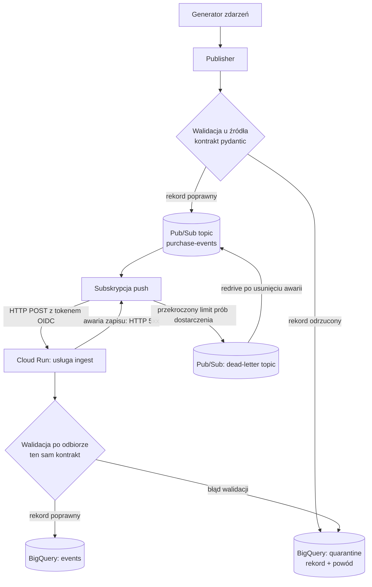
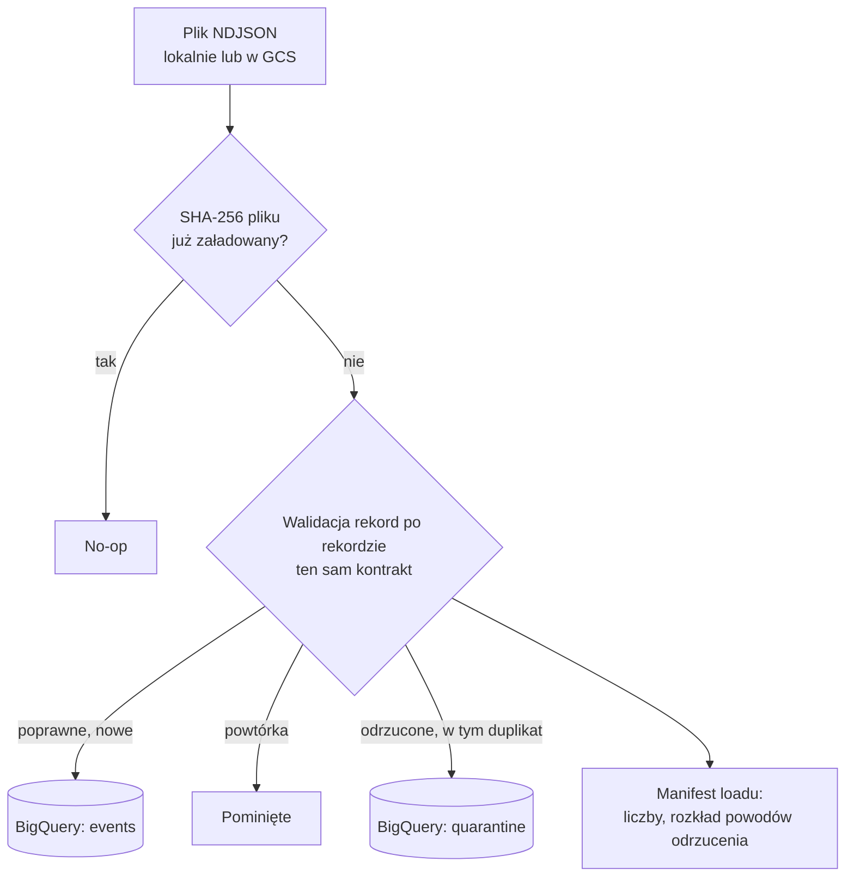
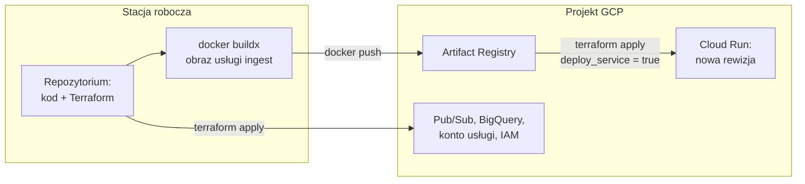

# Shift-left data quality z pydantic

Walidacja zdarzeń ecommerce **zanim** trafią do hurtowni. Jeden wersjonowany kontrakt
pydantic pilnuje dwóch pipeline'ów naraz — streamingowego i batchowego — na Google Cloud.

> **Status: projekt w budowie.** Gotowe etapy 1–6 z 7: kontrakt danych, generator z wstrzykiwaniem
> błędów, streaming na emulatorze Pub/Sub, idempotentny batch z benchmarkiem i Terraform całej
> infrastruktury GCP (219 testów, 100% pokrycia; streaming, batch i Terraform sprawdzane w CI).
> **Demo na GCP: niewykonane** — Terraform jest zwalidowany, ale świadomie nie został uruchomiony.
> Plan wszystkich etapów znajdziesz niżej, w sekcji [Etapy prac](#etapy-prac).

## Dlaczego shift-left

Zły rekord wykryty w hurtowni kosztuje wielokrotnie więcej niż ten sam rekord odrzucony
u źródła: zdążył już zasilić raporty, modele atrybucji i decyzje zakupowe. Shift-left
przesuwa walidację do momentu powstania zdarzenia — do kwarantanny trafia pojedynczy
rekord z powodem odrzucenia, a nie cała partia po fakcie.

## Szybki start

```bash
make setup   # instaluje Pythona 3.12, tworzy .venv, synchronizuje workspace uv
make check   # ruff + mypy strict + pytest — dokładnie ta sama bramka, którą odpala CI
make gen            # 1000 zdarzeń, 20% celowo zepsutych, do data/events.jsonl
make local-stream   # streaming end-to-end na emulatorze Pub/Sub (wymaga Dockera)
make batch-local    # idempotentny batch: load, ten sam plik ponownie, plik nakładający się
make bench          # koszt walidacji na 100 tys. rekordów
make schemas        # schematy tabel BigQuery z modeli pydantic
make tf-validate    # walidacja Terraforma bez konta GCP (wymaga Dockera)
```

Pełna lista komend: `make help`.

## Etapy prac

Projekt powstaje etapami. Każdy etap kończy się działającą komendą, a nie samym kodem —
jeśli czegoś nie da się uruchomić jedną komendą, etap nie jest zamknięty.

### Etap 1 — szkielet i narzędzia ✅

**Co robimy:** workspace uv z dwoma wersjonowanymi pakietami, ruff, mypy w trybie strict,
pytest z pomiarem pokrycia, Makefile jako jedyny interfejs do projektu, GitHub Actions
uruchamiające tę samą bramkę co lokalne `make check`.

**Co to dodaje:** fundament, który wymusza jedno źródło prawdy. Zależność
`dq-contracts = { workspace = true }` sprawia, że kontrakt rozwiązuje się do kodu z dysku,
więc fizycznie nie da się mieć dwóch jego wersji w dwóch pipeline'ach. Od tego momentu każdy
kolejny etap wchodzi do repozytorium przez tę samą bramkę jakości.

**Sprawdzisz:** `make check`

### Etap 2 — kontrakt danych ✅

**Co robimy:** modele pydantic opisujące zdarzenie zakupu — typy ograniczone przez
`Annotated` i `Field`, `ConfigDict(strict=True, extra="forbid")`, walidatory pojedynczych pól
(`field_validator`) i walidatory spójności między polami (`model_validator`), mapowanie
`ValidationError` na rekord kwarantanny z powodem odrzucenia. Każda reguła dostaje test
pozytywny i negatywny.

**Co to dodaje:** samą istotę projektu — wykonywalną definicję tego, czym jest poprawne
zdarzenie. Do tej pory „poprawne dane" było pojęciem z dokumentacji; od tego etapu jest
kodem, który można uruchomić i który przy złym rekordzie mówi, co konkretnie jest nie tak.

**Sprawdzisz:** `make test`

### Etap 3 — generator danych syntetycznych ✅

**Co robimy:** parametryzowany generator zdarzeń: liczba rekordów, odsetek błędnych, rodzaje
wstrzykiwanych błędów, ziarno losowości dla powtarzalności. Katalog błędów odpowiada
jeden do jednego liście reguł z etapu 2.

**Co to dodaje:** możliwość pokazania kwarantanny w działaniu. Walidator, którego nikt nie
nakarmił złymi danymi, jest wart tyle co nieuruchomiony test. Ziarno losowości sprawia, że
ten sam parametr daje ten sam zestaw danych — bez tego benchmark z etapu 5 mierzyłby szum.

**Jak to działa:** każdy rodzaj błędu w katalogu ma przypisany powód kwarantanny, którym
kontrakt musi na niego odpowiedzieć — generator jest więc też wyrocznią testową. Liczba
błędnych rekordów nie jest losowana rekord po rekordzie: generator układa plan, w którym
dokładnie `N × ERR` pozycji dostaje błąd, a rodzaje rozkładają się po równo. Znaczniki czasu
liczy od jawnego czasu odniesienia (`--reference-time`), nie od ukrytego „teraz".

```
$ make gen N=1000 ERR=0.2
dq-gen: 1000 records -> data/events.jsonl (seed=42, reference_time=...)
  valid                        800
  duplicate_transaction         25
  future_timestamp              25
  missing_field                 25
  non_positive_amount           25
  type_mismatch                 25
  unexpected_field              25
  unsupported_currency          25
  value_mismatch                25
```

Jedno zastrzeżenie wynika z natury reguły, nie z implementacji: błąd `future_timestamp` leży
1–14 godzin po czasie odniesienia, więc plik zwalidowany później przestaje go zawierać.
„Przyszłość" jest względna — dlatego reguła nie jest idempotentna w czasie.

**Sprawdzisz:** `make gen N=1000 ERR=0.2`

### Etap 4 — streaming lokalnie ✅

**Co robimy:** emulator Pub/Sub w Dockerze, publisher walidujący zdarzenia przed wysłaniem,
subskrypcja push do lokalnej usługi ingest (odpowiednik Cloud Run), walidacja po odbiorze,
temat dead-letter dla wiadomości, których nie da się przetworzyć.

**Co to dodaje:** dowód, że cały pipeline działa bez konta GCP i bez wydawania złotówki —
tym samym kodem ścieżki biznesowej, który potem pójdzie do chmury. Pokazuje też, po co
walidować dwa razy: producent nie zaśmieca tematu, konsument nie ufa producentowi.

**Jak to działa:** `make local-stream` stawia emulator Pub/Sub i obraz usługi ingest
(ten sam `Dockerfile`, który poszedłby na Cloud Run), tworzy temat, subskrypcję push
z polityką dead-letter i odgrywa trzy scenariusze:

1. **Producent shift-left** waliduje przed publikacją — złe rekordy zostają u źródła
   (`stage=source`), na temat idą wyłącznie poprawne.
2. **Producent legacy** publikuje bez walidacji — te same rodzaje błędów łapie dopiero
   usługa ingest (`stage=ingest`).
3. **Redrive** — wiadomości z tematu dead-letter wracają na temat główny i zostają przyjęte.

Na końcu raport DuckDB na plikach JSONL jest porównywany z odpowiedzią wzorcową generatora.
Rozjazd kończy przebieg błędem — demo jest jednocześnie testem end-to-end i działa w CI
jako osobny job.

```
events accepted             820
distinct transactions       820
quarantined                 200
  ingest  duplicate_transaction       10
  ...                                    (8 powodów po 10)
  source  duplicate_transaction       15
  ...                                    (8 powodów po 15)
OK   source quarantine
OK   ingest quarantine
OK   accepted events: 820
OK   no duplicate rows: 820
```

**Ograniczenie emulatora, opisane wprost:** naturalna droga na dead-letter (usługa leży,
Pub/Sub po 5 próbach przenosi wiadomość) w emulatorze nie działa niezawodnie. Przy serii
wiadomości emulator wstrzymuje push po ok. 3 nieudanych rundach i nic nie trafia na
dead-letter — sprawdzone na świeżej instancji, zarówno przy odmowie połączenia, jak i przy
HTTP 500. Scenariusz 3 kładzie więc wiadomości na temat dead-letter wprost i weryfikuje
mechanikę redrive. Polityka dead-letter jest skonfigurowana jak na produkcji, ale jej
działanie potwierdziłby dopiero prawdziwy Pub/Sub.

**Sprawdzisz:** `make local-stream`

### Etap 5 — batch lokalnie ✅

**Co robimy:** przetwarzanie całego pliku naraz, raport z przebiegu (ile rekordów przeszło,
ile wylądowało w kwarantannie, rozkład powodów odrzucenia), idempotentność (ponowne wgranie
tego samego pliku nie duplikuje wierszy) oraz benchmark na 100 tys. rekordów.

**Co to dodaje:** to, czego nie widać w streamingu — koszt walidacji w liczbach i zestawienie
`model_validate` z `model_construct` oraz `TypeAdapter`. Odpowiada na pytanie, kiedy pominięcie
walidacji jest uzasadnione, a kiedy jest po prostu oszczędzaniem na hamulcach.

**Powtórka to nie duplikat.** Przy gwarancji „co najmniej raz" ten sam rekord przychodzi
drugi raz z powodów transportowych: Pub/Sub ponawia dostarczenie, redrive publikuje
ponownie, ktoś wgrywa ten sam plik. Pipeline pamięta odcisk treści każdej przyjętej
transakcji (BLAKE2b z kanonicznego JSON-a po walidacji) i rozróżnia:

| Ten sam `transaction_id`… | Werdykt | Zapis |
| --- | --- | --- |
| …z identyczną treścią | powtórka | brak — rekord już jest |
| …z inną treścią | duplikat | kwarantanna `duplicate_transaction` |

Bez tego rozróżnienia każde ponowienie lądowało w kwarantannie i raport jakości rósł od
samego transportu. Reguła działa tak samo w streamingu i w batchu.

**Idempotentność na dwóch poziomach:**

1. **Plik** — load identyfikuje SHA-256 treści, nie nazwa. Wynik powstaje w katalogu
   roboczym i trafia na miejsce jednym `os.replace`, a manifest zapisywany jest jako
   ostatni. Ten sam plik drugi raz to no-op; load przerwany w połowie nie zostawia
   połowy danych.
2. **Wiersz** — pamięć transakcji zasilana z wcześniejszych loadów rozpoznaje wiersze,
   które już przyszły w innym pliku. To lokalny odpowiednik `MERGE ... ON transaction_id`
   w BigQuery.

```
$ make batch-local
dq-batch: a.jsonl -> load 494d2c05afdf428f: loaded
  lines 10000  accepted 9000  replayed 0  quarantined 1000
dq-batch: a.jsonl -> load 494d2c05afdf428f: skipped
dq-batch: b.jsonl -> load ff07c124aad6c257: loaded
  lines 3001  accepted 1000  replayed 2000  quarantined 1
OK   load 1 accepted: 9000
OK   load 2 is a no-op: skipped
OK   load 3 accepted only new: 1000
OK   load 3 replays skipped: 2000
OK   load 3 conflict quarantined: {'duplicate_transaction': 1}
OK   total events: 10000
OK   no duplicate rows: 10000
```

**Benchmark** (`make bench`; MacBook arm64, Python 3.12, pydantic 2.13, 100 tys.
poprawnych rekordów, najlepszy z 3 przebiegów; ostatnia kolumna liczy celowo zepsute
rekordy przepuszczone z próbki 10 tys. z 10% błędów):

| Wariant | µs / rekord | Rekordy / s | Przyjęte poprawne | Przepuszczone zepsute |
| --- | ---: | ---: | ---: | ---: |
| `json.loads` (sam parser, bez modelu) | 2,2 | 459 tys. | — | — |
| `model_validate_json` (ścieżka produkcyjna) | 6,5 | 153 tys. | 100 000 | 125 |
| `TypeAdapter.validate_json` | 6,5 | 153 tys. | 100 000 | 125 |
| `TypeAdapter(list[...])` — cała partia naraz | 6,9 | 145 tys. | 100 000 | 0¹ |
| `json.loads` + `model_validate` (strict) | 4,7 | 215 tys. | 0² | 0 |
| `json.loads` + `model_validate(strict=False)` | 8,5 | 118 tys. | 100 000 | 250 |
| `json.loads` + `model_construct` | 3,4 | 295 tys. | 100 000 | 1000 |

¹ Jeden zły rekord unieważnia całą partię — odrzucone zostają też poprawne.
² Strict w ścieżce Pythona odrzuca tekst w polach `Decimal`, `UUID` i `datetime`, czyli
każdy rekord sparsowany z JSON-a. Dlatego pipeline używa `model_validate_json`.

Co z tego wynika:

- **Walidacja kosztuje ok. 4 µs na rekord ponad samo parsowanie** — 0,65 s na 100 tys.
  zdarzeń. Przy milionie zdarzeń dziennie to kilka sekund CPU na dobę.
- **`model_construct` oszczędza ok. 3 µs i przepuszcza 100% błędów.** Zostawia przy tym
  `value` jako `str` zamiast `Decimal`, a pozycje jako surowe słowniki — model ma typy
  tylko z nazwy. Uzasadnione wyłącznie dla danych zwalidowanych chwilę wcześniej tym
  samym kontraktem, np. przy odczycie własnej tabeli `events`.
- **Tryb lax jest wolniejszy od strict i przepuszcza dwa razy więcej.** Koercja kosztuje,
  a `"2"` zamiast `2` w ilości zostaje po cichu „naprawione".
- **125 rekordów przepuszczonych przez strict to duplikaty.** Schemat z definicji ich
  nie widzi — od tego jest pamięć transakcji, a nie model.
- **Walidacja całej partii naraz nie jest szybsza**, a odbiera możliwość odrzucenia
  pojedynczego rekordu. Do sortowania na dobre i złe — tylko rekord po rekordzie.

**Sprawdzisz:** `make batch-local` oraz `make bench`

### Etap 6 — infrastruktura jako kod ✅

**Co robimy:** Terraform opisujący komplet zasobów: projekt GCP, włączenie potrzebnych API,
tematy i subskrypcje Pub/Sub, temat dead-letter, dataset i tabele BigQuery, usługa Cloud Run,
konto usługi z minimalnymi uprawnieniami. Schematy tabel generuje `make schemas` z modeli
pydantic, a CI pilnuje, żeby wygenerowany schemat nie rozjechał się z zacommitowanym.

**Co to dodaje:** domknięcie idei jednego źródła prawdy aż do hurtowni — definicja tabeli
przestaje być czymś, co ktoś kiedyś wyklikał w konsoli. Infrastruktura jest tu **kodem do
przeczytania i zwalidowania, nie uruchomioną chmurą**: `terraform apply` świadomie nie zostaje
wykonany, więc punkt „demo na GCP" pozostaje niezaznaczony. Kod ma komentarze wyjaśniające
krok po kroku, co zrobić, żeby go odpalić.

**Jak to działa:**

- **Schematy z modeli.** `make schemas` tłumaczy modele pydantic na schematy BigQuery:
  `Decimal(max_digits=12, decimal_places=2)` → `NUMERIC(12, 2)`, model zagnieżdżony →
  `RECORD`, lista → `REPEATED`, enum → `STRING` z dozwolonymi wartościami w opisie kolumny.
  Nieznany typ to błąd, nie ciche `STRING`. Test w `make check` pada, gdy model zmieni się
  bez przegenerowania schematu — rozjazd wychodzi w pull requeście, nie na produkcji.
- **Sink BigQuery.** Ta sama usługa ingest pisze lokalnie do JSONL, a na Cloud Run do BigQuery
  — przełącza ją wyłącznie `DQ_SINK`. Deduplikacja ma trzy warstwy: pamięć powtórek w
  instancji, `insertId` w BigQuery (okno ok. minuty) i widok `events_deduplicated`, z którego
  czytają raporty.
- **Terraform** (`infra/terraform/`): projekt GCP, API, Artifact Registry, Pub/Sub z push
  przez OIDC i dead-letter, BigQuery z tabelami partycjonowanymi po czasie zdarzenia, usługa
  Cloud Run, dwa konta usług z minimalnymi uprawnieniami. Nazwy zasobów pilnuje test
  względem kodu (`Topology`, schematy).
- **Walidacja bez konta.** `make tf-validate` i job CI `terraform`: `fmt -check`,
  `init -backend=false`, `validate`. Sprawdza składnię, typy i referencje; nie sprawdza
  uprawnień ani quoty — to wiedziałby dopiero `plan` z poświadczeniami.

**Świadomie poza zakresem: loader batchowy w chmurze.** Lokalny loader opiera idempotentność
na atomowej zmianie nazwy katalogu, a na zamontowanym buckecie GCS taka operacja nie jest
atomowa. Wersja chmurowa to inny mechanizm: load job BigQuery do tabeli tymczasowej i `MERGE`
po `transaction_id`. Logika walidacji jest gotowa i wspólna, brakuje tylko tego zapisu.

**Sprawdzisz:** `make tf-validate` (walidacja bez konta GCP, przez obraz Dockera)

### Etap 7 — dokumentacja

**Co robimy:** pełne README — opis problemu, diagram architektury w Mermaid, lista usług GCP
z uzasadnieniem każdej, instrukcja uruchomienia od zera, opis wszystkich reguł walidacji,
przykłady rekordów w kwarantannie z powodem odrzucenia, wyniki benchmarku, szacunek kosztów,
procedura teardown oraz sekcja decyzji architektonicznych i wariantów odrzuconych.

**Co to dodaje:** warunek, bez którego projekt nie ma sensu jako portfolio — obca osoba ma
odtworzyć całość bez zadawania pytań autorowi.

## Architektura przepływu danych

Ścieżka streamingowa — od wygenerowania zdarzenia do wiersza w hurtowni:


```mermaid
flowchart TD
    GEN[Generator zdarzeń] --> PUB[Publisher]
    PUB --> V1{Walidacja u źródła<br/>kontrakt pydantic}
    V1 -->|rekord poprawny| TOPIC[(Pub/Sub topic<br/>purchase-events)]
    V1 -->|rekord odrzucony| QUAR[(BigQuery: quarantine<br/>rekord + powód)]
    TOPIC --> SUB[Subskrypcja push]
    SUB -->|HTTP POST z tokenem OIDC| RUN[Cloud Run: usługa ingest]
    RUN --> V2{Walidacja po odbiorze<br/>ten sam kontrakt}
    V2 -->|rekord poprawny| EV[(BigQuery: events)]
    V2 -->|błąd walidacji| QUAR
    RUN -->|awaria zapisu: HTTP 5xx| SUB
    SUB -->|przekroczony limit prób dostarczenia| DLQ[(Pub/Sub: dead-letter topic)]
    DLQ -->|redrive po usunięciu awarii| TOPIC
```

Walidacja wykonuje się dwa razy i to jest decyzja, nie przeoczenie: producent nie zaśmieca
tematu, a konsument nie ufa producentowi. Koszt tej duplikacji mierzymy w etapie 5.

Rozróżnienie kwarantanny od dead-letter wynika z jednego pytania: czy ponowienie może coś
zmienić?

- **Kwarantanna** — werdykt jest deterministyczny: ten sam bajt da ten sam wynik. Trafia tu
  rekord łamiący kontrakt, a także uszkodzony JSON (`malformed_payload`). Usługa odpowiada
  204 (ack), bo retry tylko zapchałby kolejkę. Rekord zostaje zapisany razem z powodem
  i surowym payloadem, więc da się go naprawić i wgrać ponownie.
- **Dead-letter** — przetwarzanie się nie udało z przyczyn technicznych (sink niedostępny,
  usługa leży). Usługa odpowiada kodem błędu, Pub/Sub ponawia, a po wyczerpaniu prób
  przenosi wiadomość na dead-letter. Leżą tam zwykle **poprawne** zdarzenia, dlatego
  nie idą do kwarantanny — oznaczenie ich jako złych danych zafałszowałoby raport jakości.
  Po usunięciu przyczyny redrive przepuszcza je jeszcze raz.

To zmiana względem pierwotnego planu, w którym uszkodzony JSON szedł na dead-letter,
a dead-letter do kwarantanny. Powód: retry deterministycznego błędu niczego nie naprawia,
a mieszanie awarii infrastruktury z błędami danych psuje metrykę jakości.

Ścieżka batchowa — ten sam kontrakt, inny tryb pracy:


```mermaid
flowchart TD
    FILE[Plik NDJSON<br/>lokalnie lub w GCS] --> SHA{SHA-256 pliku<br/>już załadowany?}
    SHA -->|tak| SKIP[No-op]
    SHA -->|nie| VAL{Walidacja rekord po rekordzie<br/>ten sam kontrakt}
    VAL -->|poprawne, nowe| EVB[(BigQuery: events)]
    VAL -->|powtórka| DROP[Pominięte]
    VAL -->|odrzucone, w tym duplikat| QB[(BigQuery: quarantine)]
    VAL --> REP[Manifest loadu:<br/>liczby, rozkład powodów odrzucenia]
```

## Jak wyglądałoby wdrożenie

**Ważne zastrzeżenie:** w tym repozytorium infrastruktura jest **kodem, nie uruchomioną
chmurą**. Terraform jest kompletny i zwalidowany (`terraform validate`), ale `terraform apply`
świadomie nie zostaje wykonany — nie istnieje projekt GCP, nie ma rachunku, nie ma wdrożonej
usługi. Poniższy opis mówi więc, co by się stało po uruchomieniu, a nie co się wydarzyło.
Punkt „demo na GCP" w Definition of Done pozostaje niezaznaczony i tak jest to oznaczone.

### Gdzie żyje który element

| Element | Miejsce docelowe | Uwaga |
| --- | --- | --- |
| `dq-contracts` | wewnątrz obrazu usługi ingest oraz w środowisku publishera i loadera | To biblioteka, nie usługa — nie wdraża się jej osobno. Jej wersja jedzie w kopercie każdego zdarzenia. |
| Usługa ingest | Cloud Run (region `europe-central2`) | Skalowanie do zera: brak ruchu = brak kosztu. |
| Obraz kontenera | Artifact Registry | Budowany lokalnie (`docker buildx --platform linux/amd64`) i wypychany do rejestru. |
| Publisher | uruchamiany z laptopa przez ADC, docelowo Cloud Run Job | W demo to narzędzie, nie element produkcyjny. |
| Loader batchowy | docelowo Cloud Run Job (`dq-batch`) na tym samym obrazie | **Nie ma w Terraformie.** Lokalna idempotentność stoi na atomowym `rename`, którego nie ma na GCS; w chmurze potrzebny load job + `MERGE`. |
| Kolejka | Pub/Sub: temat, subskrypcja push, temat dead-letter | Subskrypcja push uwierzytelnia się do Cloud Run tokenem OIDC. |
| Dane | BigQuery: tabele `events` i `quarantine`, widok `events_deduplicated` | `events` partycjonowane po dacie zdarzenia i klastrowane po `transaction_id`; `quarantine` po dacie odrzucenia, klastrowane po etapie i powodzie. Raporty czytają widok. |
| Schematy tabel | `infra/terraform/schemas/*.json`, generowane z modeli | Terraform czyta je przez `file()`, CI pilnuje rozjazdu. |
| Stan Terraforma | bucket GCS z wersjonowaniem | W repo backend jest lokalny, bo projekt nie istnieje; plik stanu nigdy nie trafia do gita. |
| Tożsamość | dwa konta usług: `ingest-runtime` (zapis do datasetu) i `pubsub-push` (wywołanie usługi), lokalnie ADC | Zero kluczy JSON — ani w repo, ani na dysku. Agent Pub/Sub dostaje role, bez których dead-letter po cichu nie działa. |

### Droga artefaktu


```mermaid
flowchart LR
    subgraph LOCAL[Stacja robocza]
        SRC[Repozytorium:<br/>kod + Terraform]
        BUILD[docker buildx<br/>obraz usługi ingest]
    end
    subgraph GCP[Projekt GCP]
        AR[Artifact Registry]
        CR[Cloud Run:<br/>nowa rewizja]
        REST[Pub/Sub, BigQuery,<br/>konto usługi, IAM]
    end
    SRC --> BUILD
    BUILD -->|docker push| AR
    AR -->|terraform apply<br/>deploy_service = true| CR
    SRC -->|terraform apply| REST
```

Kolejność ma znaczenie i wynika z zależności: obraz musi istnieć w rejestrze, zanim Terraform
utworzy usługę Cloud Run, bo definicja usługi wskazuje na konkretny tag obrazu. Dlatego
pierwszy `apply` robi się dwuetapowo, sterowany zmienną `deploy_service`:

1. `terraform apply -var deploy_service=false` — projekt, API, rejestr, Pub/Sub, BigQuery, IAM.
2. `docker buildx build --platform linux/amd64 -t <image_repository>/dq-pipeline:<sha> --push .`
3. `terraform apply -var image_tag=<sha>` — usługa Cloud Run i subskrypcja push do niej.

Komentarze w `infra/terraform/` prowadzą przez to krok po kroku.

### Co trzeba by zrobić ręcznie

Terraform nie zrobi za nikogo trzech rzeczy, bo wymagają decyzji człowieka albo uprawnień
spoza projektu:

1. Utworzyć konto Google Cloud i podpiąć konto rozliczeniowe (nawet jeśli demo mieści się
   w limitach darmowych, Google wymaga aktywnego billingu do włączenia API).
2. Uwierzytelnić się lokalnie: `gcloud auth application-default login` — to tworzy ADC,
   czyli poświadczenia, których używa Terraform i lokalny publisher. Żadnego klucza JSON.
3. Uzupełnić `terraform.tfvars` własnym identyfikatorem projektu i numerem konta
   rozliczeniowego; szablon z pustymi wartościami leży obok jako `example.tfvars`.

Resztę — projekt, włączenie API, zasoby, uprawnienia — tworzy Terraform. Teardown to jedna
komenda (`make destroy`), która kasuje projekt razem z zawartością, więc rachunek wraca do zera.

## Struktura repozytorium

| Ścieżka | Do czego służy |
| --- | --- |
| `packages/dq-contracts/` | Kontrakt danych: modele pydantic, mapowanie błędów na kwarantannę, generowanie schematów BigQuery. Jedyne źródło prawdy, wersjonowane wg SemVer. |
| `packages/dq-datagen/` | Generator syntetycznych zdarzeń z kontrolowanym wstrzykiwaniem błędów. |
| `apps/pipeline/` | Walidator wspólny dla wszystkich etapów, sink, usługa ingest (FastAPI), publisher, redrive, raport DuckDB. |
| `Dockerfile`, `compose.yaml` | Obraz usługi ingest (ten sam lokalnie i na Cloud Run) oraz lokalne środowisko z emulatorem Pub/Sub. |
| `scripts/` | Scenariusze end-to-end, np. `local_stream.py` uruchamiany przez `make local-stream`. |
| `infra/terraform/` | Pub/Sub, BigQuery, Cloud Run, IAM. Schematy tabel generowane z modeli pydantic, nie przepisywane ręcznie. |
| `tests/` | Test pozytywny i negatywny dla każdej reguły walidacji. |
| `docs/adr/` | Decyzje architektoniczne i warianty odrzucone. |

## Konwencje

- Kod, nazwy, commity i opis repozytorium po angielsku.
- Komentarze, docstringi i dokumentacja po polsku.
- Każda zmiana przez branch i pull request, CI sprawdza lint, typy i testy.

## Licencja

MIT — zobacz [LICENSE](LICENSE).
