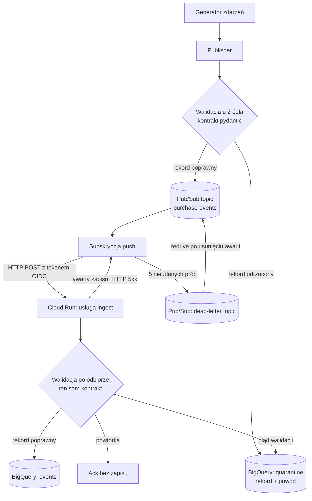
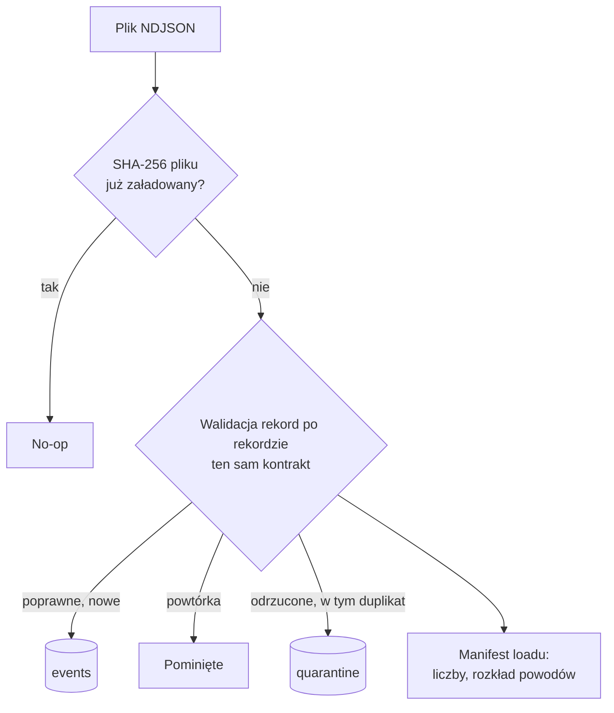
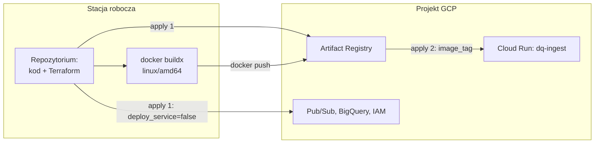

# Shift-left data quality z pydantic

[](https://github.com/pmackowka/shift-left-data-quality-pydantic/actions/workflows/ci.yml)

Walidacja zdarzeń ecommerce **zanim** trafią do hurtowni. Jeden wersjonowany kontrakt
pydantic pilnuje dwóch pipeline'ów naraz — streamingowego (Pub/Sub → Cloud Run → BigQuery)
i batchowego — a rekord, który kontraktu nie spełnia, trafia do kwarantanny z powodem
odrzucenia i oryginalną treścią.

> **Status:** wszystkie 7 etapów gotowe. 219 testów, 100% pokrycia; streaming, batch
> i Terraform sprawdzane w CI przy każdym pull requeście.
> **Demo na GCP: niewykonane.** Infrastruktura jest kompletnym, zwalidowanym kodem
> Terraforma, ale świadomie nie została uruchomiona — nie istnieje projekt GCP ani wdrożona
> usługa. Wszystko, co opisane niżej jako „działa", działa lokalnie i w CI.

## Spis treści

- [Dlaczego shift-left](#dlaczego-shift-left)
- [Co pokazuje ten projekt](#co-pokazuje-ten-projekt)
- [Architektura](#architektura)
- [Uruchomienie od zera](#uruchomienie-od-zera)
- [Kontrakt: reguły walidacji](#kontrakt-reguły-walidacji)
- [Kwarantanna: jak wygląda odrzucony rekord](#kwarantanna-jak-wygląda-odrzucony-rekord)
- [Powtórki, duplikaty i idempotentność](#powtórki-duplikaty-i-idempotentność)
- [Benchmark walidacji](#benchmark-walidacji)
- [Usługi GCP i dlaczego te](#usługi-gcp-i-dlaczego-te)
- [Wdrożenie na GCP](#wdrożenie-na-gcp)
- [Szacunek kosztów](#szacunek-kosztów)
- [Teardown](#teardown)
- [Decyzje architektoniczne](#decyzje-architektoniczne)
- [Ograniczenia i czego nie zweryfikowano](#ograniczenia-i-czego-nie-zweryfikowano)
- [Struktura repozytorium](#struktura-repozytorium)
- [Historia etapów](#historia-etapów)

## Dlaczego shift-left

Zły rekord wykryty w hurtowni kosztuje wielokrotnie więcej niż ten sam rekord odrzucony
u źródła: zdążył już zasilić raporty, modele atrybucji i decyzje zakupowe. Transakcja
z wartością niezgodną z sumą pozycji o jeden grosz przejdzie przez każdą tabelę i dashboard,
dopóki ktoś nie zauważy, że przychód z raportu nie zgadza się z systemem finansowym.

Shift-left przesuwa walidację do momentu powstania zdarzenia. Zamiast sprzątać partię po
fakcie, pipeline odrzuca pojedynczy rekord z konkretnym powodem — a reszta płynie dalej.

## Co pokazuje ten projekt

- **Jedno źródło prawdy.** Modele pydantic w `packages/dq-contracts` walidują dane
  u producenta, w usłudze ingest i w loaderze batchowym, a z tych samych modeli powstają
  schematy tabel BigQuery. Schemat nie może się rozjechać, bo istnieje w jednym miejscu.
- **Walidacja dwa razy, świadomie.** Producent waliduje przed publikacją (nie zaśmieca
  tematu), konsument po odbiorze (nie ufa producentowi). Demo pokazuje oba przypadki.
- **Kwarantanna zamiast cichych strat.** Każdy odrzucony rekord ma powód, ścieżkę pola,
  etap pipeline'u i oryginalny payload — da się go naprawić i wgrać ponownie.
- **Powtórka to nie duplikat.** Ponowione dostarczenie z Pub/Sub czy drugi raz wgrany plik
  nie zawyżają raportu jakości; dwa różne rekordy z tym samym identyfikatorem — tak.
- **Generator jako wyrocznia.** Generator danych wie, co zepsuł, więc wynik każdego demo
  jest porównywany z odpowiedzią wzorcową — rozjazd wywala build.
- **Koszt walidacji w liczbach.** Benchmark na 100 tys. rekordów: ile kosztuje walidacja
  i ile złych rekordów przepuszcza jej pominięcie.

## Architektura

Ścieżka streamingowa:


```mermaid
flowchart TD
    GEN[Generator zdarzeń] --> PUB[Publisher]
    PUB --> V1{Walidacja u źródła<br/>kontrakt pydantic}
    V1 -->|rekord poprawny| TOPIC[(Pub/Sub topic<br/>purchase-events)]
    V1 -->|rekord odrzucony| QUAR[(BigQuery: quarantine<br/>rekord + powód)]
    TOPIC --> SUB[Subskrypcja push]
    SUB -->|HTTP POST z tokenem OIDC| RUN[Cloud Run: usługa ingest]
    RUN --> V2{Walidacja po odbiorze<br/>ten sam kontrakt}
    V2 -->|rekord poprawny| EV[(BigQuery: events)]
    V2 -->|powtórka| ACK[Ack bez zapisu]
    V2 -->|błąd walidacji| QUAR
    RUN -->|awaria zapisu: HTTP 5xx| SUB
    SUB -->|5 nieudanych prób| DLQ[(Pub/Sub: dead-letter topic)]
    DLQ -->|redrive po usunięciu awarii| TOPIC
```

Ścieżka batchowa — ten sam kontrakt, inny transport:


```mermaid
flowchart TD
    FILE[Plik NDJSON] --> SHA{SHA-256 pliku<br/>już załadowany?}
    SHA -->|tak| SKIP[No-op]
    SHA -->|nie| VAL{Walidacja rekord po rekordzie<br/>ten sam kontrakt}
    VAL -->|poprawne, nowe| EVB[(events)]
    VAL -->|powtórka| DROP[Pominięte]
    VAL -->|odrzucone, w tym duplikat| QB[(quarantine)]
    VAL --> MAN[Manifest loadu:<br/>liczby, rozkład powodów]
```

**Kwarantanna czy dead-letter?** Decyduje jedno pytanie: czy ponowienie może coś zmienić
([ADR 0002](docs/adr/0002-quarantine-versus-dead-letter.md)).

| Sytuacja w usłudze ingest | Odpowiedź | Gdzie ląduje wiadomość |
| --- | --- | --- |
| rekord przyjęty | 204 (ack) | `events` |
| powtórka rekordu już przyjętego | 204 (ack) | nigdzie — zapis już jest |
| rekord łamie kontrakt albo nie jest JSON-em | 204 (ack) | `quarantine` z powodem |
| koperta niezgodna z formatem push | 422 (nack) | ponowienie → dead-letter |
| awaria zapisu (BigQuery niedostępne) | 500 (nack) | ponowienie → dead-letter → redrive |

Błąd danych dostaje ack, bo ponowienie tych samych bajtów da ten sam werdykt. Na dead-letter
leżą zwykle **poprawne** zdarzenia po awarii technicznej, dlatego wracają przez redrive,
a nie do kwarantanny — inaczej awaria infrastruktury wyglądałaby w raporcie jak zły kwartał
jakości danych.

Lokalnie i w CI miejsce Pub/Sub zajmuje emulator w Dockerze, a miejsce BigQuery — pliki JSONL
z raportem w DuckDB ([ADR 0001](docs/adr/0001-local-sink-instead-of-bigquery-emulator.md)).
Usługa ingest to ten sam obraz Dockera; sink przełącza zmienna `DQ_SINK`.

## Uruchomienie od zera

Wymagania: macOS albo Linux, `git`, `make`, [uv](https://docs.astral.sh/uv/) (sam pobierze
Pythona 3.12) oraz Docker — ten ostatni tylko do streamingu i walidacji Terraforma.
Konto Google Cloud nie jest potrzebne.

```bash
git clone https://github.com/pmackowka/shift-left-data-quality-pydantic.git
cd shift-left-data-quality-pydantic
make setup    # Python 3.12, .venv, wszystkie pakiety workspace'u
make check    # ruff + mypy strict + pytest - ta sama bramka co CI (kilka sekund)
```

Każde demo to jedna komenda i każde kończy się kontrolą wyniku:

| Komenda | Co robi | Docker | Czas |
| --- | --- | :---: | --- |
| `make gen N=1000 ERR=0.2` | 1000 zdarzeń, 20% celowo zepsutych, do `data/events.jsonl` | — | < 1 s |
| `make batch-local` | trzy loady batchowe: pierwszy, ten sam plik ponownie, plik nakładający się | — | ok. 1 s |
| `make local-stream` | emulator Pub/Sub + usługa ingest, trzy scenariusze, raport DuckDB | ✓ | ok. 1 min (+ pierwsze pobranie obrazu emulatora, ok. 1,4 GB) |
| `make bench` | koszt walidacji na 100 tys. rekordów, siedem wariantów | — | ok. 14 s |
| `make schemas` | schematy tabel BigQuery z modeli do `infra/terraform/schemas/` | — | < 1 s |
| `make tf-validate` | `terraform fmt`, `init -backend=false`, `validate` | ✓ | pierwszy raz pobiera provider Google |

Oczekiwany koniec `make local-stream` — liczby zgodne z odpowiedzią wzorcową generatora:

```
events accepted             820
distinct transactions       820
quarantined                 200
  ingest  duplicate_transaction       10
  ...                                    (8 powodów po 10)
  source  duplicate_transaction       15
  ...                                    (8 powodów po 15)
OK   source quarantine
OK   ingest quarantine
OK   accepted events: 820
OK   no duplicate rows: 820
```

Scenariusze streamingu: (1) producent waliduje przed publikacją — 120 rekordów zostaje
u źródła; (2) producent „legacy" publikuje bez walidacji — 80 złych rekordów łapie dopiero
ingest; (3) 20 wiadomości z tematu dead-letter wraca przez redrive. Po porażce kontenery
zostają do debugowania (`docker compose logs ingest`); sprzątanie: `make local-stream-down`.

Pełna lista komend: `make help`.

## Kontrakt: reguły walidacji

Model `PurchaseEvent` wzorowany na zdarzeniu `purchase` z GA4: wartość, waluta, pozycje,
wysyłka, rabat, źródło ruchu. Konfiguracja `ConfigDict(strict=True, extra="forbid",
frozen=True)`, powtórzona w modelach zagnieżdżonych, bo pydantic nie dziedziczy jej w dół.

| # | Reguła | Mechanizm pydantic | Powód w kwarantannie | Komunikat (z prawdziwego rekordu) |
| --- | --- | --- | --- | --- |
| 1 | wartość = suma pozycji + wysyłka − rabat, co do grosza | `model_validator(mode="after")`, `Decimal` | `value_mismatch` | `Transaction value 390.84 does not match line items (459.80 + shipping 0.00 - discount 68.97 = 390.83)` |
| 2 | znacznik czasu nie z przyszłości (tolerancja 5 min) | `field_validator`, `AwareDatetime` | `future_timestamp` | `Event timestamp 2026-10-02T19:22:00+00:00 is more than 0:05:00 ahead of now (…)` |
| 3 | cena i ilość dodatnie | `Field(gt=0)` w typach `Money`, `Quantity` | `non_positive_amount` | `items.1.price`: `Input should be greater than 0` (wejście `-59.49`) |
| 4 | waluta z dozwolonego zbioru | `StrEnum` | `unsupported_currency` | `Input should be 'PLN', 'EUR', 'USD', 'GBP' or 'CZK'` (wejście `CHF`) |
| 5 | brak duplikatu transakcji | `TransactionLedger` (stan, poza modelem) | `duplicate_transaction` | `Transaction 'T-12-0000003' has already been seen in this run` |
| 6a | brak pola wymaganego | pola bez wartości domyślnej | `missing_field` | `transaction_id`: `Field required` |
| 6b | brak pól nadmiarowych, także w pozycjach | `extra="forbid"` | `unexpected_field` | `items.0.gclid`: `Extra inputs are not permitted` |
| 7 | typ co do joty: `"3"` to nie `3` | `strict=True` | `type_mismatch` | `items.1.quantity`: `Input should be a valid integer` |

Poza listą reguł kwarantanna rozpoznaje jeszcze uszkodzony JSON (`malformed_payload`)
i wartości poza granicami typu — za długie pole, ilość ponad 10 000, zły wzorzec
identyfikatora (`out_of_range`). Każda reguła ma test pozytywny i negatywny, a generator —
odpowiadający jej rodzaj błędu; test kompletności pada, gdy kontrakt dostanie nowy powód
bez odpowiednika w generatorze.

Duplikat jest jedyną regułą, której nie da się sprawdzić na pojedynczym rekordzie, dlatego
żyje poza modelem: `ValidationError` mówi „ten rekord sam w sobie jest zły", a błąd biznesowy
— „rekord jest poprawny, ale nie wolno go przyjąć w tym kontekście".

Strict znaczy co innego dla JSON-a i dla obiektów Pythona. Na ścieżce produkcyjnej
(`model_validate_json`) tekst `"19.99"` jest poprawnym `Decimal`, a `"2026-10-02T10:00:00Z"`
poprawną datą — JSON nie ma tych typów. Liczba całkowita przysłana jako tekst zostaje
odrzucona w obu trybach, bo JSON potrafi ją wyrazić.

## Kwarantanna: jak wygląda odrzucony rekord

Rekord kwarantanny odpowiada na trzy pytania: co przyszło, dlaczego zostało odrzucone i gdzie
to wyszło. Przykład z usługi ingest (treść `raw_payload` skrócona):

```json
{
  "rejected_at": "2026-10-02T10:46:16.643183Z",
  "stage": "ingest",
  "reason": "value_mismatch",
  "contract_version": "0.1.0",
  "transaction_id": "T-12-0000047",
  "raw_payload": "{\"event_id\":\"afa01e95-3019-426b-8ecc-3ffa60b2faa4\",\"transaction_id\":\"T-12-0000047\",…",
  "issues": [
    {
      "field_path": "",
      "error_type": "value_mismatch",
      "message": "Transaction value 390.84 does not match line items (459.80 + shipping 0.00 - discount 68.97 = 390.83)",
      "input_value": "{'event_id': 'afa01e95-…', 'value': '390.84', 'discount': '68.97', …}"
    }
  ]
}
```

I drugi, z błędem typu w pozycji zamówienia:

```json
{
  "stage": "ingest",
  "reason": "type_mismatch",
  "transaction_id": "T-12-0000017",
  "issues": [
    {
      "field_path": "items.1.quantity",
      "error_type": "int_type",
      "message": "Input should be a valid integer",
      "input_value": "3"
    }
  ]
}
```

- `reason` to kategoria do raportu — jedna na rekord, wybrana według stałej ważności
  (błędy struktury przed błędami wartości), więc zliczenia zawsze się sumują.
- `error_type` to stabilny kod pydantic albo walidatora własnego. Mapowanie na powód idzie
  po kodzie, nigdy po treści komunikatu — komunikat wolno poprawić bez zmiany wersji kontraktu.
- `stage` mówi, gdzie błąd wyszedł: `source` (u producenta), `ingest` (producent nie
  walidował) albo `batch`.
- `raw_payload` jest oryginałem co do bajtu — rekord odrzucony bez oryginału nadaje się
  tylko do policzenia.

## Powtórki, duplikaty i idempotentność

Pub/Sub i batch dają gwarancję „co najmniej raz", więc ten sam rekord przychodzi drugi raz
z powodów transportowych. Pipeline pamięta odcisk treści każdej przyjętej transakcji
(BLAKE2b z kanonicznego JSON-a po walidacji, [ADR 0003](docs/adr/0003-replay-versus-duplicate.md)):

| Ten sam `transaction_id`… | Werdykt | Zapis |
| --- | --- | --- |
| …z identyczną treścią (także inaczej sformatowaną, w innej strefie czasu) | powtórka | brak — rekord już jest |
| …z inną treścią | duplikat | kwarantanna `duplicate_transaction` |

Loader batchowy jest idempotentny na dwóch poziomach ([ADR 0005](docs/adr/0005-batch-idempotency.md)):

1. **Plik** — load identyfikuje SHA-256 treści, nie nazwa. Wynik powstaje w katalogu
   roboczym i trafia na miejsce jednym `os.replace`; manifest zapisywany jest jako ostatni.
   Ten sam plik drugi raz to no-op, a load przerwany w połowie nie zostawia połowy danych.
2. **Wiersz** — pamięć transakcji zasilana z wcześniejszych loadów rozpoznaje wiersze,
   które przyszły już w innym pliku. To lokalny odpowiednik `MERGE ... ON transaction_id`.

```
$ make batch-local
dq-batch: a.jsonl -> load 494d2c05afdf428f: loaded
  lines 10000  accepted 9000  replayed 0  quarantined 1000
dq-batch: a.jsonl -> load 494d2c05afdf428f: skipped
dq-batch: b.jsonl -> load ff07c124aad6c257: loaded
  lines 3001  accepted 1000  replayed 2000  quarantined 1
OK   load 1 accepted: 9000
OK   load 2 is a no-op: skipped
OK   load 3 accepted only new: 1000
OK   load 3 replays skipped: 2000
OK   load 3 conflict quarantined: {'duplicate_transaction': 1}
OK   total events: 10000
OK   no duplicate rows: 10000
```

W BigQuery deduplikacja ma trzy warstwy: pamięć powtórek w instancji usługi, `insertId`
przy zapisie (BigQuery odrzuca ponowiony insert w krótkim oknie) i widok
`events_deduplicated`, z którego czytają raporty ([ADR 0004](docs/adr/0004-bigquery-streaming-inserts.md)).

## Benchmark walidacji

`make bench`: 100 tys. poprawnych rekordów, najlepszy z 3 przebiegów; ostatnia kolumna liczy
celowo zepsute rekordy przepuszczone z próbki 10 tys. z 10% błędów. MacBook arm64,
Python 3.12, pydantic 2.13 — liczą się proporcje, nie wartości bezwzględne.

| Wariant | µs / rekord | Rekordy / s | Przyjęte poprawne | Przepuszczone zepsute |
| --- | ---: | ---: | ---: | ---: |
| `json.loads` (sam parser, bez modelu) | 2,2 | 459 tys. | — | — |
| `model_validate_json` (ścieżka produkcyjna) | 6,5 | 153 tys. | 100 000 | 125 |
| `TypeAdapter.validate_json` | 6,5 | 153 tys. | 100 000 | 125 |
| `TypeAdapter(list[...])` — cała partia naraz | 6,9 | 145 tys. | 100 000 | 0¹ |
| `json.loads` + `model_validate` (strict) | 4,7 | 215 tys. | 0² | 0 |
| `json.loads` + `model_validate(strict=False)` | 8,5 | 118 tys. | 100 000 | 250 |
| `json.loads` + `model_construct` | 3,4 | 295 tys. | 100 000 | 1000 |

¹ Jeden zły rekord unieważnia całą partię — odrzucone zostają też poprawne.
² Strict w ścieżce Pythona odrzuca tekst w polach `Decimal`, `UUID` i `datetime`, czyli
każdy rekord sparsowany z JSON-a.

- **Walidacja kosztuje ok. 4 µs na rekord ponad samo parsowanie** — 0,65 s na 100 tys.
  zdarzeń, kilka sekund CPU na dobę przy milionie zdarzeń dziennie.
- **`model_construct` oszczędza ok. 3 µs i przepuszcza wszystko**, łącznie z ujemną kwotą
  i walutą BTC. Zostawia też `value` jako `str` zamiast `Decimal` — model ma typy tylko
  z nazwy. Uzasadniony wyłącznie dla danych zwalidowanych chwilę wcześniej tym samym kontraktem.
- **Tryb lax jest wolniejszy od strict i przepuszcza dwa razy więcej** — koercja kosztuje,
  a `"2"` zamiast `2` zostaje po cichu „naprawione".
- **125 rekordów przepuszczonych przez strict to duplikaty.** Schemat ich z definicji nie
  widzi — od tego jest pamięć transakcji.

Wnioski i warianty odrzucone: [ADR 0006](docs/adr/0006-strict-mode-and-validate-json.md).

## Usługi GCP i dlaczego te

| Usługa | Rola | Dlaczego ta, a nie alternatywa |
| --- | --- | --- |
| **Pub/Sub** | temat zdarzeń, subskrypcja push, dead-letter | Zarządzana kolejka z dead-letter i retry z backoffem w konfiguracji, bez utrzymywania brokera. Kafka (np. Confluent) dałaby kolejność i replay na dłuższy okres, ale przy tym wolumenie to klaster do utrzymania bez korzyści. |
| **Cloud Run** | usługa ingest odbierająca push | Skaluje do zera (brak ruchu = brak kosztu), przyjmuje zwykły kontener, a uwierzytelnienie OIDC sprawdza platforma. Cloud Functions ograniczyłyby obraz i lokalne testy; GKE to klaster dla jednej usługi. |
| **BigQuery** | tabele `events`, `quarantine`, widok z deduplikacją | Hurtownia docelowa ecommerce'u (GA4 eksportuje tu dane), płatność za przeczytane bajty, partycjonowanie po czasie zdarzenia. Schemat generowany z modeli. |
| **Artifact Registry** | obraz `dq-pipeline` | Rejestr w tym samym regionie co Cloud Run, uprawnienia przez IAM projektu. |
| **IAM** | dwa konta usług + role agenta Pub/Sub | Osobna tożsamość dla usługi (pisze do datasetu) i dla wywołującego (tylko woła usługę). Zero kluczy JSON. |

Region `europe-central2` (Warszawa) dla wszystkiego: dane w UE, bez transferu między
regionami. Świadomie **bez** Dataflow (koszt i złożoność nieproporcjonalne do walidacji
pojedynczych rekordów), bez subskrypcji BigQuery w Pub/Sub (zapis z pominięciem walidacji po
odbiorze) i bez Cloud Storage (batch nie jest wdrożony w chmurze — patrz ograniczenia).

## Wdrożenie na GCP

> Ta sekcja opisuje, co **by się stało** po uruchomieniu. Kod jest kompletny
> i zwalidowany (`terraform validate` w CI), ale `terraform apply` nie został wykonany.

Terraform w `infra/terraform/` tworzy również sam projekt. Ręcznie trzeba zrobić trzy rzeczy,
bo wymagają decyzji człowieka albo uprawnień spoza projektu:

1. Konto Google Cloud z aktywnym kontem rozliczeniowym — bez billingu nie da się włączyć
   Cloud Run ani BigQuery, nawet w darmowych limitach.
2. `gcloud auth application-default login` — poświadczenia ADC dla Terraforma i publishera.
3. `cp infra/terraform/example.tfvars infra/terraform/terraform.tfvars` i uzupełnienie
   identyfikatora projektu oraz konta rozliczeniowego (plik jest w `.gitignore`).

Pierwszy `apply` jest dwuetapowy, bo usługa Cloud Run wskazuje na obraz, którego nie da się
wypchnąć, zanim istnieje rejestr. Steruje tym zmienna `deploy_service`:

```bash
cd infra/terraform
terraform init
terraform apply -var deploy_service=false        # projekt, API, rejestr, Pub/Sub, BigQuery, IAM

gcloud auth configure-docker europe-central2-docker.pkg.dev
docker buildx build --platform linux/amd64 \
  -t "$(terraform output -raw image_repository)/dq-pipeline:$(git rev-parse --short HEAD)" \
  --push ../..                                    # Cloud Run uruchamia obrazy amd64

terraform apply -var deploy_service=true \
  -var image_tag=$(git rev-parse --short HEAD)    # Cloud Run + subskrypcja push

export DQ_GCP_PROJECT=$(terraform output -raw project_id)
cd ../..
make gen
uv run dq-pubsub publish data/events.jsonl      # publisher z walidacją u źródła
```


```mermaid
flowchart LR
    subgraph LOCAL[Stacja robocza]
        SRC[Repozytorium:<br/>kod + Terraform]
        BUILD[docker buildx<br/>linux/amd64]
    end
    subgraph GCP[Projekt GCP]
        AR[Artifact Registry]
        CR[Cloud Run: dq-ingest]
        REST[Pub/Sub, BigQuery, IAM]
    end
    SRC -->|apply 1: deploy_service=false| REST
    SRC -->|apply 1| AR
    SRC --> BUILD
    BUILD -->|docker push| AR
    AR -->|apply 2: image_tag| CR
```

Stan Terraforma jest lokalny, bo bucket na stan nie istnieje przed pierwszym `apply`.
Przeniesienie do GCS z wersjonowaniem opisuje komentarz w `versions.tf`.

## Szacunek kosztów

Scenariusz: **1 mln zdarzeń miesięcznie** (ok. 33 tys. dziennie), średnie zdarzenie 550 B
(zmierzone na generatorze), region `europe-central2`. Ceny i darmowe limity ze stron cennika
Google Cloud sprawdzone 2026-10-02; to lista cen w USD dla regionów USA — w Warszawie część
stawek jest nieco wyższa. To wyliczenie, nie rachunek z działającego projektu.

| Pozycja | Zużycie | Darmowy limit / mies. | Koszt / mies. |
| --- | --- | --- | ---: |
| Pub/Sub — przepustowość | publikacja w paczkach ok. 0,5 GiB + push ok. 1 GiB (min. 1 KB na żądanie) | 10 GiB | $0 |
| Pub/Sub — retencja tematu 7 dni | ok. 0,12 GiB-miesiąca ($0,27 / GiB-mies.) | — | ~$0,03 |
| Cloud Run | 1 mln żądań; ≤ 100 tys. vCPU-s i ≤ 50 tys. GiB-s przy założeniu 100 ms na żądanie | 2 mln żądań, 180 tys. vCPU-s, 360 tys. GiB-s | $0 |
| BigQuery — zapis `insertAll` | 1 mln wierszy × min. 1 KB ≈ 977 MiB (od $0,01 / 200 MiB) | brak | ~$0,05 |
| BigQuery — magazyn | ok. 0,5 GiB przyrostu miesięcznie | 10 GiB | $0 |
| BigQuery — zapytania | raporty na partycjach | 1 TiB | $0 |
| Artifact Registry | jeden obraz | 0,5 GB | $0* |
| **Razem** | | | **~$0,08** |

\* Darmowy limit mieści jeden, góra dwa obrazy; trzymanie wielu tagów zaczyna kosztować.

- **Bez ruchu** usługa skaluje do zera, a koszt sprowadza się do retencji tematu i magazynu
  — pojedyncze centy.
- **Pierwsza rzecz, która rośnie z wolumenem,** to zapis do BigQuery: `insertAll` płaci od
  pierwszego bajtu, a Storage Write API ma 2 TiB miesięcznie za darmo. Przy tej skali różnica
  to centy, dlatego wybór padł na prostszy interfejs — z zaznaczeniem jako kandydat do zmiany.
- **Minima rozliczeniowe dominują nad rozmiarem danych:** zdarzenie ma 550 B, a Pub/Sub
  i BigQuery liczą co najmniej 1 KB za żądanie / wiersz.

## Teardown

```bash
make destroy   # terraform destroy w kontenerze, z ADC z ~/.config/gcloud
```

Projekt ma `deletion_policy = "DELETE"`, a tabele i usługa `deletion_protection = false`,
więc jedna komenda usuwa projekt razem z zawartością i rachunek wraca do zera. Google trzyma
usunięty projekt jeszcze 30 dni z możliwością przywrócenia; identyfikator projektu nie wraca
do puli. Lokalnie: `make local-stream-down` i `make clean`.

## Decyzje architektoniczne

| ADR | Decyzja | Odrzucone warianty |
| --- | --- | --- |
| [0001](docs/adr/0001-local-sink-instead-of-bigquery-emulator.md) | lokalnie sink JSONL + DuckDB | emulator BigQuery (zielony test bez pokrycia dla `NUMERIC` i `MERGE`), Postgres |
| [0002](docs/adr/0002-quarantine-versus-dead-letter.md) | kwarantanna dla błędów danych, dead-letter dla awarii, redrive na temat | zły JSON na dead-letter i dead-letter do kwarantanny |
| [0003](docs/adr/0003-replay-versus-duplicate.md) | powtórka vs duplikat po odcisku treści, pamięć w pipelinie | sam identyfikator, para identyfikatorów, zmiana rejestru w kontrakcie |
| [0004](docs/adr/0004-bigquery-streaming-inserts.md) | `insertAll` + `insertId` + widok z deduplikacją | Storage Write API (kandydat do zmiany), subskrypcja BigQuery, `MERGE` na każdy zapis |
| [0005](docs/adr/0005-batch-idempotency.md) | SHA-256 pliku, atomowy rename, pamięć wierszy | rejestr nazw plików, dopisywanie do wspólnych plików |
| [0006](docs/adr/0006-strict-mode-and-validate-json.md) | strict + `model_validate_json` rekord po rekordzie | lax, `model_construct`, walidacja całej partii |

Decyzje mniejsze, opisane w komentarzach przy kodzie: workspace uv z zależnościami
`{ workspace = true }` (fizycznie jedna kopia kontraktu), `Decimal` zamiast `float` dla kwot
(porównanie co do grosza bez progu tolerancji), wersja kontraktu w każdym zdarzeniu,
generator z jawnym czasem odniesienia (reguła „nie z przyszłości" nie jest idempotentna w czasie).

## Ograniczenia i czego nie zweryfikowano

- **Demo na GCP: niewykonane.** `terraform validate` sprawdza składnię, typy i referencje;
  uprawnień, quoty i tego, czy Google przyjmie konfigurację, nie sprawdzi bez `plan`/`apply`.
  Sink BigQuery jest testowany jednostkowo z podmienionym klientem.
- **Dead-letter end-to-end.** Emulator Pub/Sub przy serii wiadomości wstrzymuje push po ok.
  3 nieudanych rundach i niczego nie przenosi na dead-letter (sprawdzone na świeżej instancji,
  przy odmowie połączenia i przy HTTP 500). Demo kładzie wiadomości na dead-letter wprost
  i weryfikuje redrive; samo przeniesienie potwierdziłby dopiero prawdziwy Pub/Sub.
- **Loader batchowy nie jest wdrożony w chmurze.** Jego idempotentność stoi na atomowej
  zmianie nazwy katalogu, której nie ma na GCS. Wersja chmurowa: load job + `MERGE`.
- **Pamięć powtórek jest per instancja.** Przy kilku instancjach Cloud Run ostatnią
  gwarancją jest widok `events_deduplicated`, nie tabela.
- **`future_timestamp` jest względny.** Plik wygenerowany dziś i zwalidowany za dobę nie
  zawiera już części tych błędów — demo i testy podają czas odniesienia jawnie.

## Struktura repozytorium

| Ścieżka | Do czego służy |
| --- | --- |
| `packages/dq-contracts/` | Kontrakt: modele pydantic, mapowanie błędów na kwarantannę, schematy BigQuery. Bez zależności od GCP, wersjonowany wg SemVer. |
| `packages/dq-datagen/` | Generator zdarzeń z katalogiem błędów i odpowiedzią wzorcową. Narzędzie deweloperskie — nie trafia do obrazu. |
| `apps/pipeline/` | Walidator wspólny dla wszystkich etapów, sinki (JSONL, BigQuery), usługa ingest, publisher, redrive, loader batchowy, raport DuckDB. |
| `infra/terraform/` | Projekt GCP, Pub/Sub, BigQuery, Cloud Run, IAM; `schemas/` generowane przez `make schemas`. |
| `scripts/` | Scenariusze end-to-end (`local_stream.py`, `batch_local.py`) i benchmark. |
| `Dockerfile`, `compose.yaml` | Obraz pipeline'u (ten sam lokalnie i na Cloud Run) i lokalne środowisko z emulatorem. |
| `tests/` | Testy kontraktu, generatora, pipeline'u i spójności nazw z Terraformem. |
| `docs/adr/` | Decyzje architektoniczne z wariantami odrzuconymi. |

## Historia etapów

Projekt powstawał etapami; każdy kończył się jedną działającą komendą.

| Etap | Co powstało | Komenda | Pull requesty |
| --- | --- | --- | --- |
| 1 | workspace uv, ruff, mypy strict, pytest, Makefile, CI | `make check` | commit startowy |
| 2 | kontrakt pydantic, mapowanie na kwarantannę, 81 testów | `make test` | #4 |
| 3 | generator z katalogiem błędów i odpowiedzią wzorcową | `make gen` | #6, #7, #8 |
| 4 | walidator, usługa ingest, emulator Pub/Sub, redrive, raport DuckDB | `make local-stream` | #10–#13 |
| 5 | powtórka vs duplikat, idempotentny loader, benchmark | `make batch-local`, `make bench` | #15–#18 |
| 6 | schematy z modeli, sink BigQuery, Terraform | `make tf-validate` | #20–#23 |
| 7 | ADR 0002–0006, ta dokumentacja | — | #25, #26 |

## Konwencje

- Kod, nazwy, commity i opis repozytorium po angielsku; komentarze, docstringi i dokumentacja
  po polsku.
- Każda zmiana przez branch i pull request; CI uruchamia lint, typy, testy, streaming, batch
  i walidację Terraforma.

## Licencja

MIT — zobacz [LICENSE](LICENSE).
